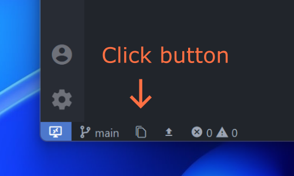
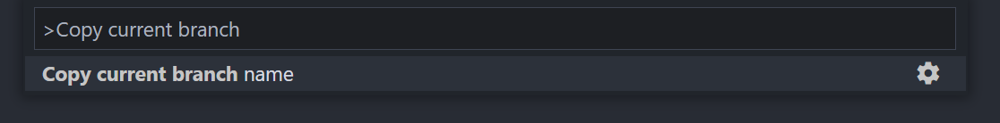

<h1 align="center">
   
    
    
  VS Code - Copy Branch Name
   
   
</h1>

<h4 align="center">Copy the current Git branch name to your clipboard.</h4>

    &nbsp;
    &nbsp;
    &nbsp;
    

## How it works

### Status Bar

After installing this extension you will find a new icon in the status bar. As soon as you click on it, it will be copied to your clipboard so that you can paste it somewhere else in your workflow.

### Command palette

In addition, it's also possible to run the copy command via VS Code command palette. The command is called `Copy current branch name`.

If the name of the branch was successfully copied to the clipboard, a message text appears in the status bar for a few seconds.
